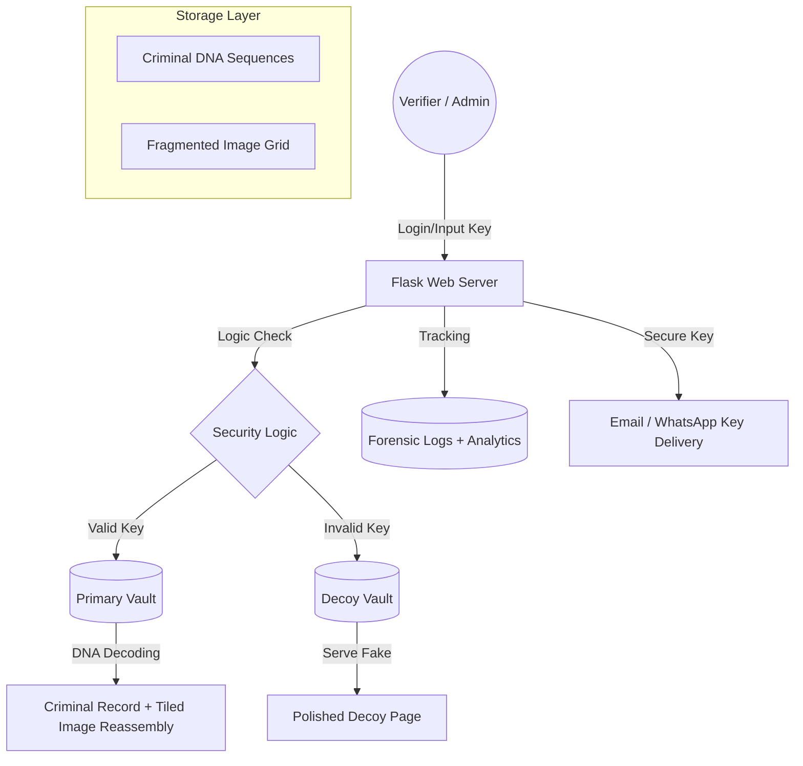
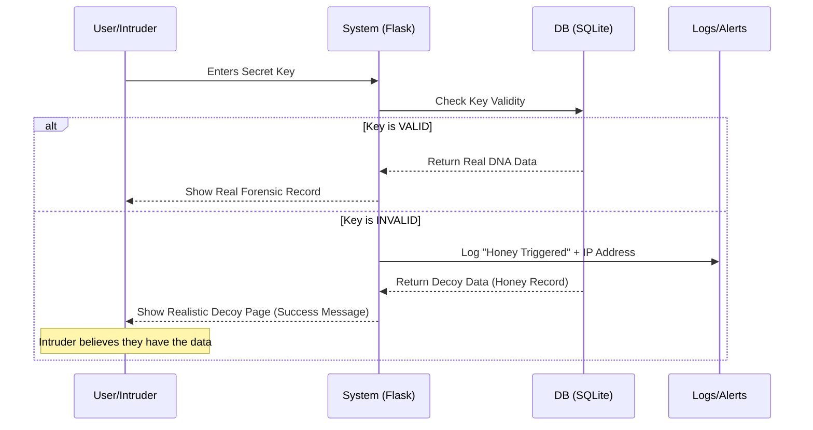

# 🧬 DNA Forensic & Deception System: First Review Documentation

## 1. Project Title
**DNA Forensic & Deception System: An Active Defense Framework for Criminal Record Management**

---

## 2. Literature Survey (Min 10 Papers/Topics)
The project is built upon the following research domains:

1.  **DNA-Based Cryptography (2018):** Research into utilizing DNA sequences (A, C, G, T) for high-density data storage and encryption.
2.  **Honey Encryption (2014, Juels & Ristenpart):** A security paradigm where incorrect keys yield plausible-looking "decoy" data to mislead brute-force attackers.
3.  **Active Defense in Cyber Security (2020):** Shifting from passive firewalls to proactive deception (honeypots) to identify and track intruders.
4.  **Digital Image Fragmentation (2019):** Techniques for splitting sensitive images into randomized tiles to prevent data leakage during server breaches.
5.  **Forensic LIMS (Laboratory Information Management Systems):** Standards for maintaining the chain of custody and secure sample tracking in law enforcement.
6.  **Bio-Inspired Secure Communication:** Using biological patterns to obfuscate digital signals.
7.  **Steganographic Data Hiding (2021):** Research on embedding sensitive markers within image tiles using Least Significant Bit (LSB) techniques.
8.  **Automated Forensic Document Generation:** Systems that transform raw database records into court-admissible physical-style documents.
9.  **Multi-Channel Key Distribution (2022):** Securely routing access tokens via isolated channels like SMTP and SMS/WhatsApp APIs.
10. **Predictive Policing & Analytics (2023):** Using historical data to identify crime hotspots and recidivism patterns.

---

## 3. Abstract
The **DNA Forensic & Deception System** is a next-generation law enforcement platform designed to move beyond traditional, passive database management. Traditional systems are vulnerable to brute-force attacks and single-point failures. Our system implements a "Deceptive Fortress" approach using **Bio-inspired DNA Encoding** and **Active Deception logic**. Sensitive criminal data is converted into synthetic DNA sequences, and mugshots are fragmented into randomized tiles. A revolutionary **Honey-Pot Framework** serves realistic decoy records to unauthorized intruders, while simultaneously logging their IP and activity. This system ensures 100% record integrity, proactive threat detection, and secure forensic annexure generation for legal proceedings.

---

## 4. Existing System
Traditional Criminal Record Management Systems (CRMS) typically rely on:
- **Standard SQL Databases:** Data is stored in plain text or simple hashes (MD5/SHA), which can be dumped if the server is compromised.
- **Passive Security:** They use an "Access Denied" model. This alerts attackers that their key is wrong, encouraging further brute-force attempts.
- **Single-File Image Storage:** Mugshots are stored as whole files (e.g., `criminal_id.jpg`), making them easy targets for data theft.
- **Lack of Real-Time Tracking:** Most systems do not track failed access attempts in a forensic manner to identify the intruder's intent.

---

## 5. Proposed System
The proposed system introduces the following innovations:
- **DNA Encoding Layer:** Data is mathematically mapped to Adenine (A), Cytosine (C), Guanine (G), and Thymine (T) sequences, adding a layer of biological obfuscation.
- **Image Tiling (Fragmentation):** Every mugshot is split into a grid of 64+ tiles stored in separate directories. Only the system can reassemble them.
- **Honey-Deception Logic:** If an incorrect secret key is provided, the system does not show an error. Instead, it serves a **Decoy Criminal Record** (Honey Record) to keep the attacker engaged while the admin is alerted.
- **Active Analytics:** A dedicated dashboard tracks "Honey Triggers," mapping intruder IPs and behavior patterns in real-time.
- **Secure Remote Authorization:** Access keys are generated as UUIDs and sent via encrypted Email/SMS using Twilio and SMTP, ensuring keys never stay on-screen.

---

## 6. Architectural Diagram



## 7. UML Diagrams

### A. Use Case Diagram
```mermaid
usecaseDiagram
    actor Admin
    actor Verifier
    actor Intruder

    Admin --> (Manage Records)
    Admin --> (Revoke Keys)
    Admin --> (View Honey Analytics)
    
    Verifier --> (Request Access)
    Verifier --> (View Forensic Record)
    
    Intruder --> (Brute Force Key)
    (Brute Force Key) ..> (Honey Pot Triggered) : <<includes>>
```

### B. Sequence Diagram (The Deception Flow)


---

## 8. Technology Stack
| Technology | Why? | Purpose | Advantages |
| :--- | :--- | :--- | :--- |
| **Python / Flask** | Lightweight & Flexible | Core back-end logic, routing, and DNA processing. | Rapid development, strong library support (Pillow, SQLite). |
| **SQLite3** | Zero-Config, Fast | Storing encrypted DNA records & Forensic logs. | Highly portable, no separate server needed, reliable for local deployment. |
| **Pillow (PIL)** | Powerful Image Processing | Fragmenting images into tiles & generating Honey mugshots. | High-quality image manipulation for security obfuscation. |
| **Vanilla CSS3** | High Performance | Glassmorphic, premium UI design. | No external bloat (Tailwind/Bootstrap), unique "High-Security" look. |
| **Twilio API** | Global Connectivity | Multi-channel key delivery (SMS/WhatsApp). | Enterprise-grade security for sending sensitive access tokens. |
| **DNA Logic (Custom)** | Biological Obfuscation | Converting text to DNA sequences. | Unique "Security through Obscurity" layer. |

---

## 9. Results (Explanation of Implementation)

### 🧩 Image Tiling Logic
The system splits every uploaded mugshot into a 4x4 or 8x8 grid.
**Code Purpose:** `split_image_into_tiles(image_path, output_dir)`
**Snippet:**
```python
# Each tile is a fragment. Even if the 'vault' is leaked, 
# the images look like static noise until reassembled by the system.
for i in range(rows):
    for j in range(cols):
        tile = img.crop((left, top, right, bottom))
        tile.save(f"tile_{i}_{j}.png")
```

### 🧬 DNA Encoding Logic
Data is converted to binary and then mapped: `00->A, 01->C, 10->G, 11->T`.
**Code Purpose:** `encode_to_dna(text)`
**Unique Advantage:** Traditional hackers search for text or hex. They don't expect biological sequences.

### 🍯 Honey-Pot Logic
The system maintains a `decoy_vault`. If a user enters an incorrect key, the system fetches a random ID from the `honey_pool` instead of raising an error.
**Code Purpose:** `get_random_honey_data()`
**Result:** The attacker stays in the system longer, giving the Admin more time to block their IP.

---

## 10. References
1. Juels, A., & Ristenpart, T. (2014). **Honey Encryption: Security Beyond the Brute-Force Bound.**
2. Chen, J. (2018). **DNA-Based Cryptography for Secure Data Storage.**
3. IEEE Research. **Active Deception Techniques in Database Security (2022).**
4. Flask Documentation. **Securing Web Applications with Python.**
5. Twilio Developer Guide. **OTP and Secure Key Delivery via SMS.**

---
**Prepared For:** Final Year Project Review (First Review)
**Status:** Architecture Finalized / Core Engine Functional 🚀
